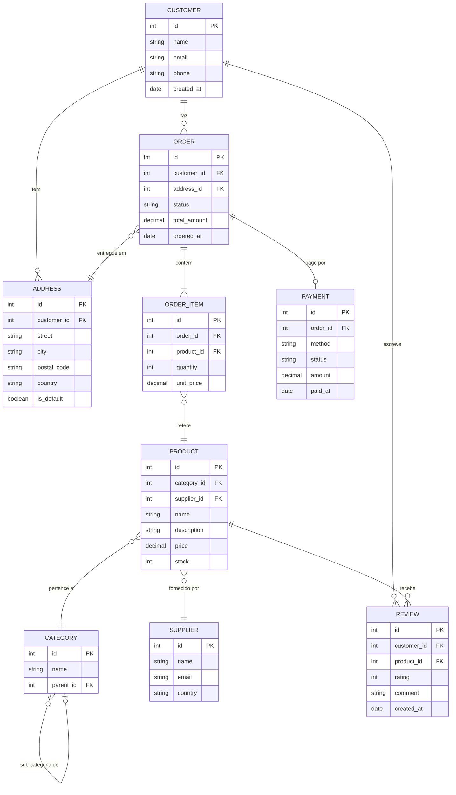

# Diagrama ER — Sistema de E-commerce

Exemplo com dados fictícios para demonstrar as capacidades do Mermaid ER diagrams.

## Diagrama Completo

---

## Legenda de Cardinalidades

| Símbolo | Significado              |
|---------|--------------------------|
| `\|\|`  | Exatamente um            |
| `o\|`   | Zero ou um               |
| `\|\{`  | Um ou mais               |
| `o{`    | Zero ou mais             |

---

## Dados de Exemplo

### Clientes
| id | name           | email                  | phone       |
|----|----------------|------------------------|-------------|
| 1  | Ana Silva      | ana@email.com          | 912 345 678 |
| 2  | Bruno Costa    | bruno@email.com        | 961 234 567 |
| 3  | Catarina Neves | catarina@email.com     | 935 678 901 |

### Produtos
| id | name              | category_id | price   | stock |
|----|-------------------|-------------|---------|-------|
| 1  | Laptop Pro 15"    | 1           | 1299.99 | 15    |
| 2  | Teclado Mecânico  | 2           | 89.90   | 42    |
| 3  | Monitor 27" 4K    | 1           | 449.00  | 8     |

### Encomendas
| id | customer_id | status    | total_amount | ordered_at |
|----|-------------|-----------|--------------|------------|
| 1  | 1           | entregue  | 1389.89      | 2026-01-10 |
| 2  | 2           | expedido  | 449.00       | 2026-02-01 |
| 3  | 3           | pendente  | 89.90        | 2026-02-19 |

---

## Notas sobre a Sintaxe Mermaid ER

- **`PK`** — Primary Key (chave primária)
- **`FK`** — Foreign Key (chave estrangeira)
- Tipos suportados: `string`, `int`, `decimal`, `boolean`, `date`, etc.
- Relações auto-referenciadas são suportadas (ex: `CATEGORY` → `CATEGORY`)
